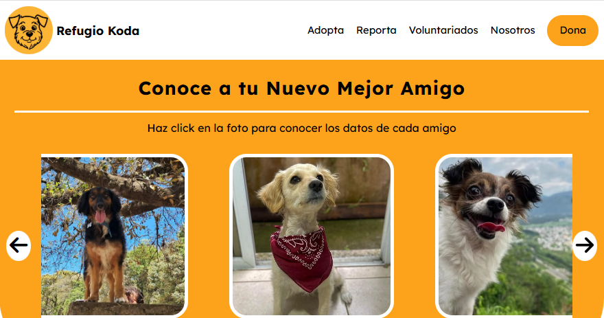
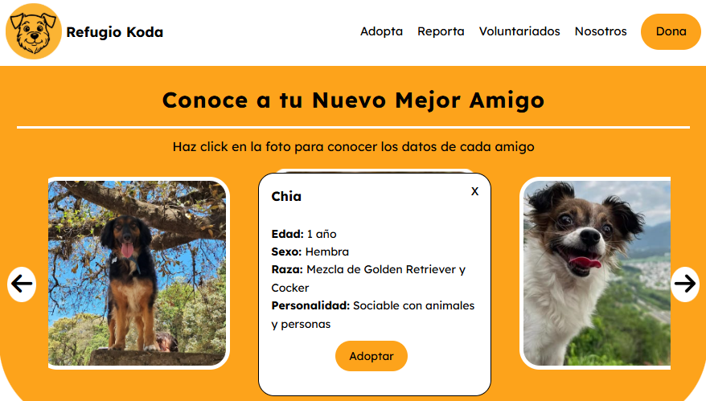
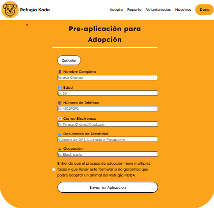
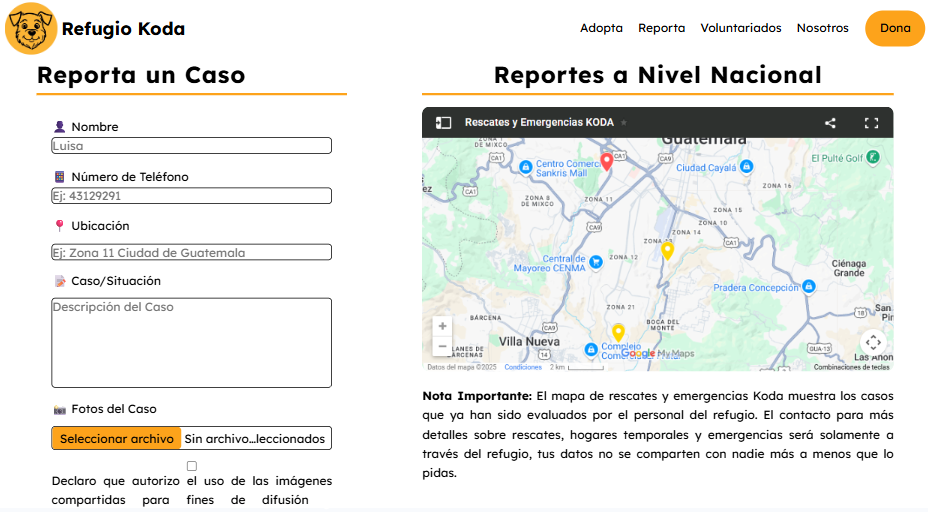
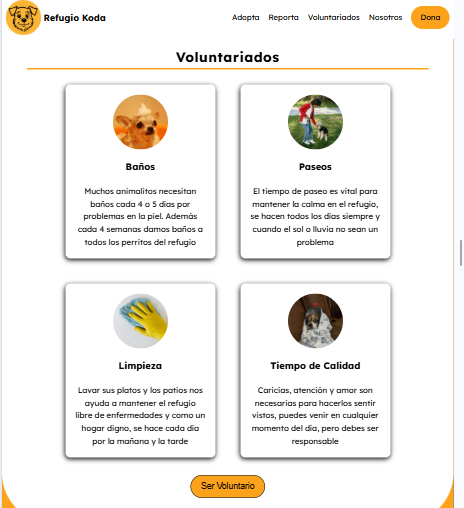
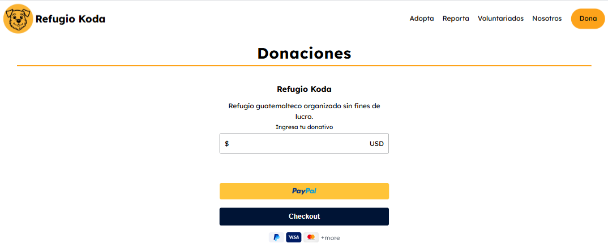

# Refugio Koda

Refugio guatemalteco organizado sin fines de lucro y sustentado por donativos orientado al rescate, la rehabilitación y reubicación de animales en situaciones vulnerables.

## Índice

- [Nombre y Eslogan](#nombreyeslogan)
- [Temática](#tematica)
- [Paleta de Colores](#colores)
- [Tipografía](#tipografia)
- [Estrategia UX](#estrategiaux)
- [Proceso de Diseño](#procesodediseño)
- [Formularios](#formularios)
- [Desafíos y soluciones](#desafiosysoluciones)
- [Funcionalidad](#Funcionalidad)
## Nombre y Eslogan 

El nombre del refugio es en honor al perro de la fundadora, Koda, hoy Cody fue el primer perro rescatado, y la descripción en la sección "Nosotros" es verdadera, se le llamó así por la película "Tierra de Osos".

Es un refugio, no una ONG o fundación porque no está legalmente registrado.

El eslogan del sitio es de tipo emocional, muestra la identidad del proyecto: Sanar. ¿El distintivo? El valor que suma el amor para el proceso de recuperación.

## Temática

Esta web está enfocada en crear una red de contactos y apoyo para combatir la indiferencia. Nace de la necesidad de apoyo, alimento y hogares dignos que enfrentan los animales en Guatemala.

Así pues nacen las secciones: Adopta, Reporta y Voluntariados. La idea es hacerle saber a la población que siempre hay una forma de ayudar, que lo importante es empezar.

## Paleta de Colores

La temática visual busca armonía y generar conexiones reales.

Citando a Grecia Gúzman de Psicología y Mente sobre el color naranaja: "Tiene relación con la sociabilidad, la originalidad, la extraversión, la actividad o el entusiasmo y la cercanía."

En contraste con el blanco permite un interacción estimulante, pero que permite al usuario enfocarse en lo que lee.

## Tipografía

Lexend Deca, fuente obtenida de google fonts, creada por Bonnie Shaver-Troup y Thomas Jockin, pertenece a una familia de 7 fuentes creadas para mejorar la habilidad lectora, inicialmente enfocada a personas con dislexia.

La fuente es neutral y transmite calma, emoción que ligada al color naranja nos ayuda a involucrar más al usuario en nuestra narrativa.

## Estrategia UX

Se establecen necesidades y propósitos compretos evitanto la sobrestimulación de información.

Eetiquetas html están estructuradas de forma semántica a modo de apoyo para los lectores de pantalla. 

Enlaces en optimas condiciones para la navegación interactiva del sitio.

Uso de clamp y Lexend deca para mejor legibilidad y adaptación del texto a pantallas pequeñas.

## Proceso de Diseño

Se realizaron 4 maquetados para lograr un enfoque profesional, amigable e interactivo.

El primer maquetado se realizó en Figma, era caricaturizado, sin un eslogan claro, enfocado a servicios. Fue descartado porque no era lo que el refugio necesitaba.

El segundo maquetado era caricaturizado con 3 colores y un logo tipo sticker, orientado a ayudar al usuario. Fue descartado para crear un nbalance entre la ayuda que el usuario dará y la ayuda que recibirá.

El tercer maquetado hecho en papel estableció el eslogan, eliminó colores vibrantes e inició la interactividad.

El diseño final incluye apoyo para ambas partes, formularios para interactividad, un color bien contrastado, y decoración puntual.

## Formularios

Se crearon dos formularios a partir de HTML, el primero para adopciones (principal necesidad de la página) y el segundo para reportes (red de apoyo)

Para la precalificación de adopciones se utilizó la herramienta Formspree.io, la cuenta fue creada con un correo de gmail en su versión gratuita con capacidad de 50 formularios al mes.

Para el formulario de reportes se utilizó la versión gratuita de Getform.io con capacidad para 25 formularios al mes.

En ambas se creó un folder para la sección y dentro del folder los archivos para almacenar los datos en horario America/Guatemala. En ambas plataformas el host es la plataforma no el html para ahorrar tiempo en la carga de la web.

## Desafíos y soluciones

Diseño responsivo mobile first: Escribí código una semana y media utilizando la pantalla de escritorio como referencia, al probar en pantallas móviles el disño no era responsivo, se veía ajustado y se desbordaba en ciertas sections. Conservé las áreas que se adaptaban, modifiqué fuentes e imágenes con clamp y max-width, continué trabajando evaluando distintos tamaños con cada cambio importante.

Orden de CSS: Registre animaciones, transiciones y diseños en el orden en que escribiía el código, la hoja de estilos no tenía orden ni estructura. Lo ordené por sección y coloqué media queries al final.

Registro de sections y divs: Para los efectos de CSS necesitaba muchos divs, me confundía y aplicaba estilos a los equivocados. Comencé a trabajar con el método pomodoro para relajarme y prestar más atención.

functions de JS: Nunca había utilizado funciones y transmitir las ideas de mi cabeza al computador era un gran reto. Describí los pasos en pseudocódigo y lo convertí a funciones.

Centrar iframe de Paypal: El centrado no se ajustaba con ninguna función conocida (justify content, align items, flex wrap, flex direction column). Al inspeccionar la página se encontró otro contenedor, al cambiar la configuración predeterminada se pudo centrar.

## Funcionalidad

### Hero Section

### Adopciones, tarjeta pop out y formulario desplegable

### Reportes

### Voluntariados y Tarjetas interactivas

### Donaciones paypal integrado

